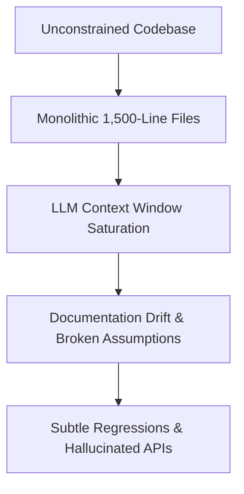
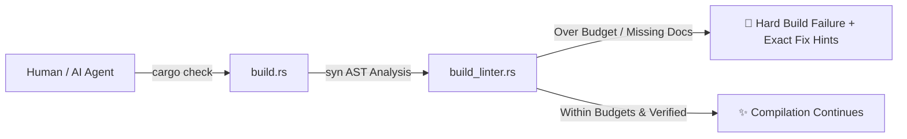

# Code as Documentation: How I Built the Rust Agent-Native Template for AI Pair Programming

In 2026, AI coding agents—whether powered by Google Antigravity, Claude Code, Cursor, or custom local daemons like Tuner—are no longer experimental novelties. They write significant portions of our production software, refactor legacy modules, and diagnose distributed bottlenecks.

However, as projects grow in scale, anyone pair programming with autonomous LLM agents quickly hits a wall: **the Context Wall**.



When files swell past 1,000 lines, context windows get saturated with irrelevant boilerplate. Documentation written in separate Markdown wikis drifts away from actual code, leading AI agents to hallucinate non-existent interfaces. Even worse, well-meaning agents often cram complex logic into existing monolithic functions rather than architecting clean, decomposed modules.

To solve this fundamentally, I developed and open-sourced the [**Rust Agent-Native Template**](https://github.com/imwoo90/rust-agent-native-template). 

In this article, I share the architectural philosophy, compile-time AST enforcement mechanisms, and practical migration stories behind making Rust codebases natively collaborative for both humans and AI.

---

## 🧭 1. The Core Philosophy: "Code as Documentation" (Living LLM-Wiki)

External documentation always rots. In an agent-native paradigm, **the Rust source code itself must be the living, compiler-verified LLM-Wiki**.

### `mod.rs` as `index.md`
Rust's hierarchical module system mirrors a directory wiki. Every folder's `mod.rs` serves as that subsystem's `index.md` (table of contents and architectural charter). 

Using module-level inner doc comments (`//!`), `mod.rs` establishes:
1. The domain responsibilities of the module.
2. Inter-module data flow and ownership boundaries.
3. High-level exported components and their usage scenarios.

When an AI agent navigates a project, reading `mod.rs` immediately provides a high-signal architectural map without polluting context with low-level implementation details.

### Compiler-Verified Intra-Doc Links & Doctests
Instead of vague references, agents and developers write typed intra-doc links (e.g. `[WorkerPool](crate::pool::WorkerPool)`). 

When `cargo doc` runs with `RUSTDOCFLAGS="-D warnings"`, rustdoc checks every single link against the compiler's symbol table. If an interface is renamed or deleted, compilation halts immediately. Furthermore, all code snippets inside doc comments (`///`) are executed as doctests during `cargo test`, guaranteeing that code examples never go stale.

---

## ⚙️ 2. Compile-Time Invariants: Hard Guardrails via `build.rs` & `syn`

Advisory guidelines in prompt templates (`AGENTS.md`) are easily overlooked during long agent trajectories. **Rules must have teeth: they must be enforced at compile time.**

Inside the template, a standalone AST linter engine (`build_linter.rs`) runs during `cargo check`, `cargo build`, and `cargo test`:



Configured declaratively via `.agent-lint.toml`, the engine enforces five strict structural invariants:

### Rule 1: File-Level Living Wiki Header (Min 100 Characters)
Every non-test production `.rs` file must begin with a `//!` header of **at least 100 characters**. This forces every file to explicitly declare its purpose, rationale, and dependencies before any code is written.

### Rule 2: Active Production Code Budget (Max 10,000 Characters)
A single file's production code lines (excluding comments, doc comments, empty lines, and `#[cfg(test)]` blocks) must not exceed **10,000 characters** (~250–300 SLOC). Exceeding this limit indicates bloated responsibility and forces decomposition into focused submodules.

### Rule 2b: Inline Unit Test Budget in `src/` (Max 5,000 Characters)
Inline unit test suites (`#[cfg(test)]`) inside `src/` files are capped at **5,000 characters**. 
* Public integration tests move to the root `tests/` directory.
* Large unit suites requiring access to private crate items are extracted into dedicated submodule files (e.g. `src/<module>/tests.rs`).

This keeps production source files dense with domain logic while allowing comprehensive test coverage.

### Rule 3: File Documentation Budget (Max 4,000 Characters)
Documentation comments (`//`, `///`, `//!`) cannot exceed **4,000 characters** per file. This prevents verbose comment inflation and forces explanations to remain dense, crisp, and high-signal.

### Rule 4: Function Physical Size Budget (Max 2,000 Characters)
Every individual function (production or test, from signature to closing brace) must fit within **2,000 characters** (~40–50 physical lines). This guarantees that any function fits cleanly within a single terminal screen or a single LLM context window turn.

### The Anti-Code-Golfing Principle & Zero Escape Hatches
To prevent AI agents from "gaming" the limits, the template enforces strict countermeasures:
* **No `#[allow(...)]` overrides**: AST limits cannot be suppressed with compiler attributes.
* **No Code-Golfing**: AI agents are strictly instructed never to shorten descriptive identifiers (`transaction_context` -> `tc`) or remove idiomatic formatting to circumvent line budgets. Clean modularization is the only acceptable resolution.

---

## 🛡️ 3. Packaging Safety: Zero-Unwrap and Complete API Contracts

In addition to syntactic budgets, standard Rust 1.74+ package lints elevate code safety:

```toml
# Cargo.toml
[lints.rust]
missing_docs = "deny"

[lints.clippy]
unwrap_used = "deny"
expect_used = "deny"
```

1. **`missing_docs = "deny"`**: Every public struct, enum, trait, and function must have outer doc comments (`///`), ensuring that no public API is undocumented.
2. **`unwrap_used = "deny"`**: Panic-prone `.unwrap()` and `.expect()` calls are completely forbidden in production. Code must use typed `Result<T, E>` and `?` operator propagation, ensuring rock-solid runtime resilience.

---

## 🤖 4. Multi-Agent Orchestration & Lean Context Delivery

Different developers and teams use different AI assistants: Claude Code, Google Antigravity, Cursor, or GitHub Copilot.

Having conflicting instructions across multiple markdown files causes massive prompt confusion. The template resolves this through a **Single Source of Truth (SSOT)** model:

```
├── AGENTS.md                  # The Canonical SSOT (Universal Standard)
├── GEMINI.md                  # Lightweight bridge for Antigravity / Gemini
├── CLAUDE.md                  # Lightweight bridge for Claude Code
├── .cursor/rules/             # Rule definition for Cursor IDE
└── .github/copilot-instructions.md
```

`AGENTS.md` is the only source of architectural truth; platform-specific files merely point back to it. Furthermore, the initialization script (`scripts/init.sh`) provides an `--agent` flag:

```bash
# Initialize a project keeping ONLY instructions for your active agent
./scripts/init.sh my-service --agent gemini
```

If you specify `--agent gemini`, all other agent files (`CLAUDE.md`, `.cursor/`, Copilot instructions) are automatically scrubbed, preventing unnecessary file clutter and keeping your workspace lean.

---

## 🧪 5. Battle Testing in Production: RusTerm & The Rust Journey

Theory is good; production verification is better. Over the past few weeks, I migrated two real-world projects to this exact template:

### Case Study 1: RusTerm (WebAssembly Serial Terminal)
`RusTerm` is an installation-free serial terminal running on Dioxus, WebAssembly, Web Workers, and OPFS. Migrating it to the Agent-Native template forced massive monolithic worker loops to be decomposed into clean, specialized state machines (`worker/terminal.rs`, `worker/storage.rs`, `worker/transport.rs`). 

### Case Study 2: The Rust Journey (This Blog)
This blog itself was migrated to the template! During the migration:
1. We upgraded to **Rust 2024 Edition** to support native let-chains in the AST linter.
2. We activated compile-time `build_linter.rs` in `build.rs`.
3. Complex views like `contact.rs` (which exceeded 10,000 characters) were cleanly decomposed into `contact/mod.rs`, `contact/form.rs`, and `contact/info.rs`.
4. We verified zero regressions across 25 distinct checkpoints using a comprehensive **Playwright interactive E2E test suite**:

```text
========================================================================
🚀 The Rust Journey Exhaustive UX/UI Behavioral & Integration Suite
========================================================================
[01/25] Serving static files from: target/dx/my_blog/release/web/public...
[02/25] Launching Sandboxed Google Chrome...
[03/25] Testing Clean WASM Mount on http://127.0.0.1:8095/the-rust-journey/...
[06/25] Testing Theme Toggle & LocalStorage Sync...
[12/25] Navigating to Blog Gallery & Real-Time Search...
[15/25] Navigating into Blog Post Detail & Syntax Highlighting...
[23/25] Testing Contact Form Validation Guardrails...
[24/25] Testing Valid Form Submission & Async Delay...
[25/25] Testing Mobile Responsiveness & 404 Route Resilience...
------------------------------------------------------------------------
Page Errors: 0, Console Errors: 0
✨ ALL 25 CHECKPOINTS PASSED CLEANLY (Zero-Defect) in 17.38s!
```

---

## 🚀 6. Getting Started

You can spin up an Agent-Native Rust project in seconds using `cargo-generate`:

```bash
# 1. Generate project from template
cargo generate imwoo90/rust-agent-native-template --name my-project

# 2. Or initialize with custom agent filtering and clean scaffold
cd my-project
./scripts/init.sh my-project --clean --agent gemini

# 3. Verify compiler guardrails immediately
cargo check
cargo test
cargo clippy
```

Explore the source code, open issues, and contribute on GitHub:
👉 [**github.com/imwoo90/rust-agent-native-template**](https://github.com/imwoo90/rust-agent-native-template)

By enforcing architectural boundaries at compile-time and treating code as the living documentation, we can build Rust systems that humans and AI agents can develop together with total confidence.
