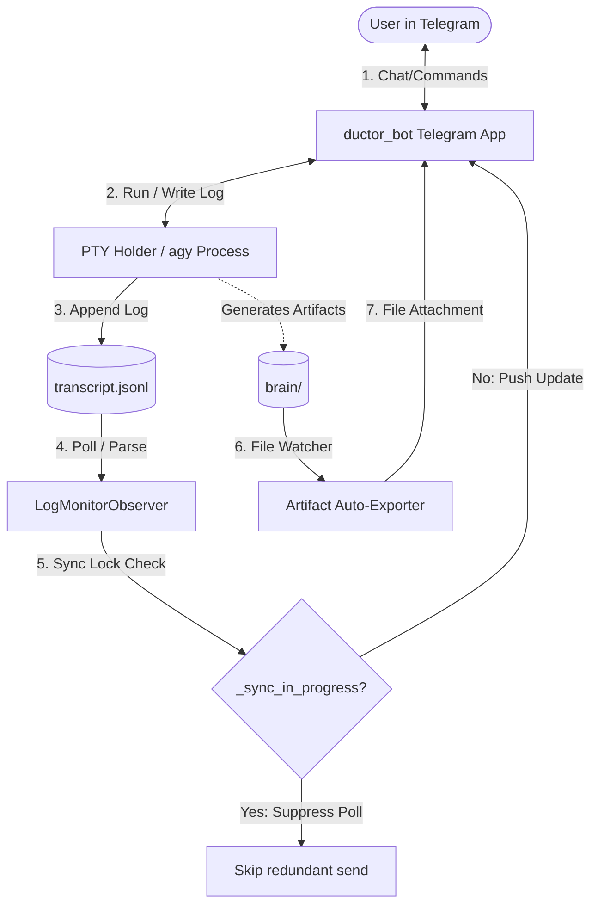

# 🤖 Ductor for Antigravity (ductor_for_agy)

`ductor_for_agy` is a specialized, production-ready fork of the **Ductor** bot orchestrator framework. It is custom-tailored to bridge the gap between local terminal systems and the **Google Antigravity (AGY)** AI agent framework over Telegram, creating an autonomous, resilient, and responsive personal coding assistant.

---

## 🚀 Key Features

*   **🔄 PTY Session Warm-keep (Lazy-Loaded PTY)**: Keeps an interactive `agy --prompt-interactive` virtual terminal (PTY) alive in the background (with ECHO disabled). This prevents Google Cloud session timeouts and provides sub-second response times.
*   **🔒 Concurrency Lock (`_sync_in_progress`)**: Resolves the "double response" bug. A synchronization lock prevents the background log monitoring thread from outputting duplicate messages while a synchronous reply is currently transmitting.
*   **📑 Polymorphic LogWatcher (`LogMonitorObserver`)**: Refactored the core log watcher loop out of the Telegram app's global lifecycle. It is now a clean, polymorphically registered `LogMonitorObserver` that integrates with the main orchestrator lifecycle hooks.
*   **🎭 Rich Collapsible Telegram Formatting**: Automatically parses thought traces and tool-execution logs. It converts long, noisy thinking processes and tool calls into expandable/collapsible Telegram quote blocks, keeping the chat clean and mobile-friendly.
*   **📌 Provider-Scoped Telegram Command Menu**: Dynamically updates the Telegram menu options based on the active provider. Injects agy-specific commands (`/plan`, `/goal`, `/grill_me`, `/learn`, `/teamwork_preview`) dynamically into the UI.
*   **📁 Automatic Artifact Delivery**: Detects when new or modified Markdown artifacts (like plans, summaries, or analyses) are generated in the agent's internal `brain/` directory. Automatically copies them to `output_to_user/` and sends them as physical file attachments.
*   **💬 Non-Blocking Telegram Planning (No-TUI Fallback)**: Solves the limitation of terminal-based interactive multiple-choice prompts (`ask_question`). In headless execution, a scoped instruction redirects the interactive Bubbletea TUI questions into clean markdown text responses and terminates the turn, allowing the user to reply via Telegram and resume progress via `--continue`.

---

## 🛠️ Architecture Overview

The system operates as an orchestration loop that coordinates user messages, the local filesystem, and the Antigravity agent:



---

## ⚡ Technical Highlights

### 1. PTY Warm-keep Session
To bypass the initialization overhead of the Antigravity CLI environment, `cli/antigravity_provider.py` lazily initializes a pseudo-terminal PTY. The process runs continuously, capturing standard output stream segments as they are populated, while managing clean shutdowns to prevent orphaned zombie processes.

### 2. Collapsible Log Parser
Telegram's Markdown V2 parser is notoriously strict. The custom `LogParser` handles recursive tags, escapes special characters safely, and embeds thoughts inside expandable blocks:
```python
# Encapsulating thinking blocks in collapsible spoilers/quotes
formatted = f"**Thinking Process:**\n||{thoughts}||"
```

### 3. Non-Blocking Headless Dialogue (No-TUI Fallback)
Terminal interactive prompts (`ask_question`) typically hang on standard input. Rather than keeping processes blocked in the background (which wastes CPU and risks timeouts), we injected workspace rules (`RULES-antigravity.md`) that instruct the agent to output questions/choices as normal text and gracefully exit the process. The Telegram daemon receives this, outputs it to the user, and when the user replies, inputs the choice into `agy --continue` to seamlessly progress the task.

---

## 🏗️ Deployment & Configuration

Deploying the custom fork under systemd:

```bash
# Clone the fork
git clone -b custom https://github.com/imwoo90/ductor_for_agy.git

# Install dependencies with uv
uv sync

# Setup environment variables in ~/.ductor/.env
PPLX_API_KEY=sk-xxxx
DEEPSEEK_API_KEY=sk-yyyy

# Restart Ductor daemon
systemctl --user restart ductor
```
