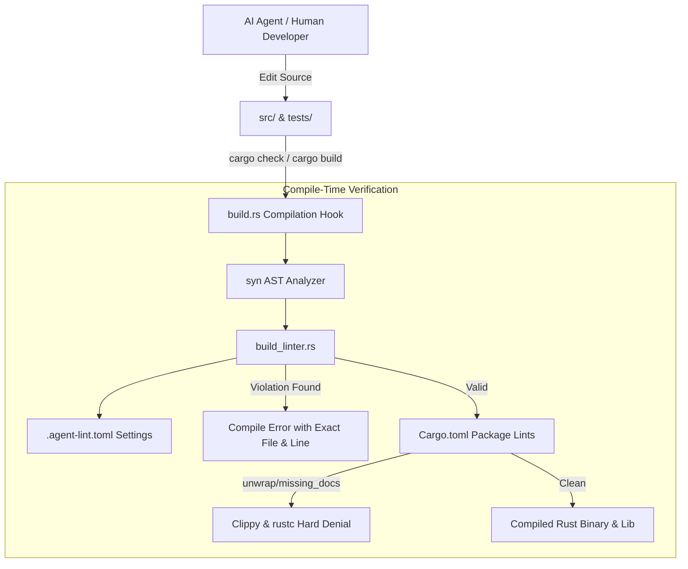

# 🤖 Rust Agent-Native Template

The **Rust Agent-Native Template** is an opinionated, compiler-enforced starter architecture engineered from the ground up for high-efficiency pair programming between human software engineers and autonomous AI coding agents (Google Antigravity, Claude Code, Cursor, GitHub Copilot).

Instead of relying on fragile prompt guidelines that get forgotten during deep development trajectories, the template turns architectural standards, file budgets, and documentation rules into **hard compilation barriers** enforced directly by Cargo and rustc.

---

## 🚀 Key Architectural Pillars

*   **📖 Code as Documentation (Living LLM-Wiki)**: Leveraging Rust's module hierarchy, every directory's `mod.rs` serves as the `index.md` architecture catalog for that subsystem. All intra-doc links (`[Type]`) and documentation code snippets (`doctests`) are compiler-verified at build time.
*   **🛡️ Compile-Time AST Linting (`build.rs`)**: An integrated AST linter powered by `syn` inspects source code during `cargo check` and `cargo build`. If code exceeds physical limits, compilation halts immediately with concrete refactoring hints.
*   **📏 Declarative Budgets (`.agent-lint.toml`)**:
    *   **Rule 1**: Min 100 characters in module-level `//!` living-wiki headers.
    *   **Rule 2**: Max 10,000 active production code characters per file.
    *   **Rule 2b**: Max 5,000 inline unit test characters in `src/` (forces test submodules or `tests/` extraction).
    *   **Rule 3**: Max 4,000 documentation comment characters per file.
    *   **Rule 4**: Max 2,000 physical characters per individual function.
*   **🚫 Anti-Code-Golfing & Zero Escape Hatches**: Hard rules cannot be silenced via `#[allow(...)]`. Agents are explicitly barred from compressing identifiers or omitting whitespace to bypass budgets.
*   **🔒 Panic-Free Production Lints**: Declares `[lints.clippy]` with `unwrap_used = "deny"` and `expect_used = "deny"`, mandating typed `Result<T, E>` and `?` propagation.
*   **🎯 Multi-Agent SSOT & Dynamic Pruning**: Maintains `AGENTS.md` as the Single Source of Truth. The `./scripts/init.sh` CLI supports `--agent <name>` (e.g. `gemini`, `claude`, `cursor`) to prune unused configuration files and minimize context window clutter.

---

## 🏗️ Architecture Pipeline



---

## ⚡ Quick Start

### 1. Initialize via `cargo-generate`
```bash
cargo generate imwoo90/rust-agent-native-template --name my-service
```

### 2. Or Clone and Run Project Re-namespacing
```bash
git clone https://github.com/imwoo90/rust-agent-native-template my-service
cd my-service

# Initialize cleanly for Antigravity / Gemini
./scripts/init.sh my-service --clean --agent gemini
```

### 3. Verify Strict Compiler Guardrails
```bash
cargo check
cargo test
cargo clippy
RUSTDOCFLAGS="-D warnings" cargo doc --no-deps
```

---

## 🌐 Real-World Deployments

The Agent-Native pattern has been battle-tested across multiple production codebases:
1. **[RusTerm](https://github.com/imwoo90/rusterm)**: A high-performance WebAssembly browser serial terminal using OPFS and Web Workers.
2. **[The Rust Journey](https://imwoo90.github.io/the-rust-journey/)**: A Dioxus 0.7 fullstack SSG technical blog running under Rust 2024 edition and Playwright E2E automation.
3. **[Tuner](https://github.com/imwoo90/tuner)**: A standalone Rust autonomous agent supervisor runtime with Axum webhooks and systemd supervision.
