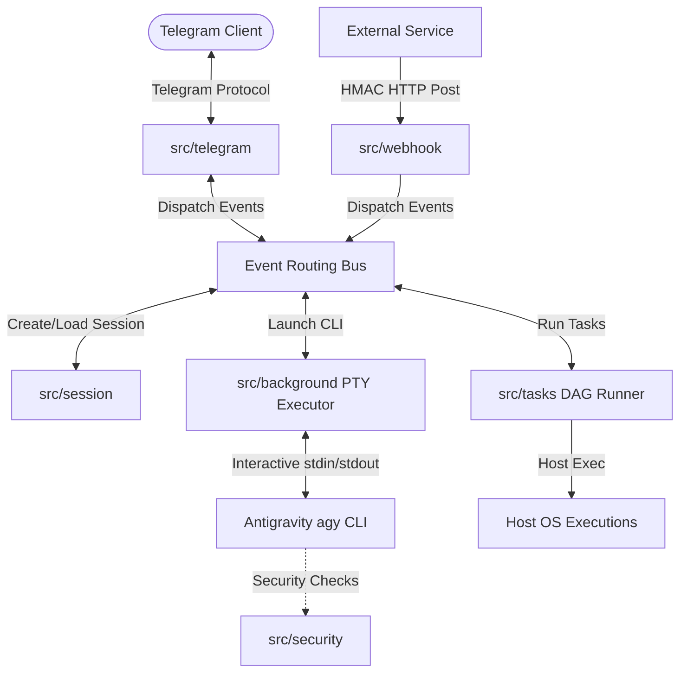

# 🤖 Tuner - Rust Agent Supervisor

`tuner` is a Rust-based **Agent Supervisor and Automation Runtime** built for the Google Antigravity (AGY) ecosystem. Built from the ground up, it deprecates the legacy Python-based `ductor_for_agy` service to deliver high performance, memory safety, and strict compile-time check limits.

It manages and monitors the execution of the Antigravity CLI (`agy`), providing native Telegram messenger integration, secure webhook reception, background task supervision, dependency-driven DAG task execution, and multi-language localized sessions.

---

## 🚀 Key Features

*   **💬 Telegram Messenger Integration**: Native support for the Telegram bot protocol, routing messages, executing command shortcuts, and mapping AI prompts to interactive UI buttons (Inline Keyboards).
*   **🔄 Background PTY Task Supervision**: Spawns long-running agent tasks in virtual PTY sessions. Supports real-time stdout/stderr streaming, log redirection, execution timeout constraints, and safe cancellation (PTY SIGKILL process cleanup).
*   **🛡️ Compile-Time Guardrails (`build.rs`)**: Integrates codebase design limits (such as `AGENT.md` rules restricting function size to 2,000 characters and logical file limits) directly into the compiler pipeline. Cargo builds fail immediately if bounds are exceeded.
*   **🔗 Axum Webhook & API Servers**: Features a robust, lightweight Axum-based async web server with HMAC-SHA256 signature verification, Bearer Token authentication, and built-in Rate Limiting.
*   **📊 DAG Task Scheduler**: Analyzes and schedules task dependency graphs (DAG) inside the workspace, allowing parallel/sequential execution on the host machine.
*   **📂 Workspace & Skill Initialization**: Automatically synchronizes workspace rules (`CLAUDE.md`, `GEMINI.md`, `AGENTS.md`) and symlinks custom skill directories on startup.
*   **⏰ Cron Scheduler & Quiet Hours**: Manages periodic check-ins, telemetry reporting, and scheduled tasks while respecting configurable system-wide Quiet Hours constraints.
*   **💾 Persistent Session Manager**: Structured JSON-based session storage tracking message history, LLM model state, token usage, and cumulative API costs (USD) per topic.
*   **🌐 Dynamic Localization (i18n)**: Out-of-the-box support for multiple languages (including English as default and Korean). Chat language can be changed dynamically on a per-session basis via the `/lang` slash command.

---

## 🛠️ Architecture Overview

The system operates as an asynchronous, multi-threaded supervisor that bridges external triggers (messages, webhooks, crons) with the local system shell and agent processes:



---

## ⚡ Technical Highlights

### 1. Compile-Time Size & Complexity Constraints
To prevent codebase bloat and enforce "source code itself is a wiki" guidelines, `build.rs` compiles checks directly into the Cargo build pipeline. It scans the source files (`src/**/*.rs`), ensuring:
*   No single function exceeds 2,000 characters.
*   Logical lines of code and docstring comments maintain a healthy balance.
Any violation aborts compilation, forcing developers to refactor immediately and maintain clean modular boundaries.

### 2. Event-Driven Asynchronous Event Bus
Using Rust's async runtime (`tokio`), `tuner` processes external signals (Telegram long polls, Axum webhook HTTP requests, Cron ticks) as events on a central `EventBus`. The bus routes these to the correct `Session` or background worker, ensuring thread-safe concurrency without memory leaks.

### 3. Webhook Receiver with HMAC signature verification
`src/webhook` exposes an API server built on Axum that listens for external events (e.g., CI/CD builds, GitHub webhooks, alert managers). Every incoming payload is validated against a pre-shared secret using HMAC-SHA256, ensuring secure, non-interactive trigger delegation to the AI agent runtime.

---

## 🏗️ Getting Started & Installation

To run `tuner` locally on a Linux desktop:

```bash
# Clone the repository
git clone https://github.com/imwoo90/tuner.git
cd tuner

# Check compilation
cargo check

# Compile production release binary
cargo build --release

# Install as a systemd user service
./target/release/tuner --install-systemd

# Manage the user service
systemctl --user enable tuner.service
systemctl --user restart tuner.service
journalctl --user -u tuner.service -f
```
