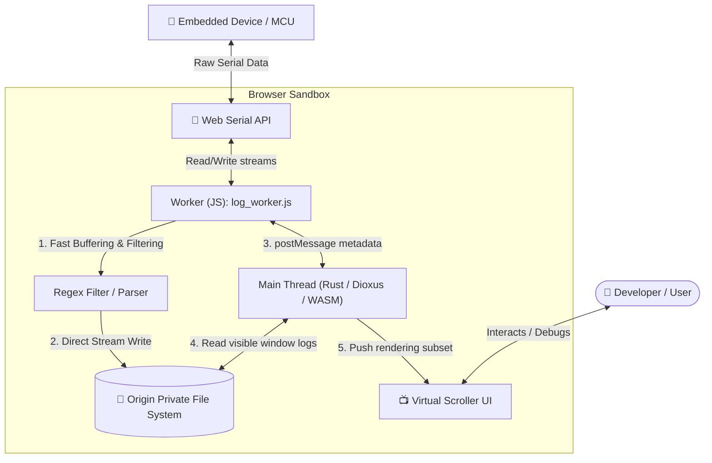

# 📡 RusTerm: Browser-Based Serial Monitor

This project reimagines the traditional desktop serial monitor as a powerful, zero-installation web application. Built with **Rust (Dioxus)** and **WebAssembly**, it challenges the limits of browser capabilities by handling high-frequency hardware data streams without performance degradation.

## 🚀 Why Use RusTerm?

- **Zero Installation**: Access a full-featured serial monitor from any Chrome/Edge browser instantly. No drivers, no installers.
- **Native Performance**: Leverages **Web Workers** for multi-threaded processing and **OPFS (Origin Private File System)** to handle gigabyte-scale logs without memory issues.
- **Custom Baud Rates**: Unlike most web monitors, this tool supports custom baud rate entry, crucial for specialized embedded debugging.
- **Advanced Filtering**: RegEx support, case sensitivity tuning, and "Invert" logic for finding exactly what you need in a noisy log stream.
- **Virtual Scrolling**: Renders millions of log lines smoothly by only drawing what is visible on the screen.

## 🛠️ Technical Architecture

The application implements a high-performance, non-blocking pipeline using Web Workers and the browser's virtual file system:

### 1. Multi-Threaded Core
To prevent UI freezing during high-speed data bursts, the application uses a dual-thread architecture:
-   **Main Thread (Rust/Dioxus)**: Handles the UI, state management, and user interactions.
-   **Web Worker (JavaScript)**: Manages the `SerialPort` stream, data buffering, string parsing, and file storage.

### 2. Origin Private File System (OPFS)
Data isn't stored in RAM. It's streamed directly to a virtual file system within the browser. This allows the monitor to record for hours or days (up to GBs of data) without crashing the tab due to Out-Of-Memory errors.

### 3. The "Heavy Lifting" JavaScript Worker
While the application is architected in Rust, the extreme performance requirements necessitated a pragmatic approach. The core buffering, encoding/decoding, and regex filtering logic resides in an optimized JavaScript Worker (`assets/js/log_worker.js`) to minimize WASM<->JS string copying overhead and leverage direct Web API access.

## 📦 How to Run

### Launch RusTerm
[https://imwoo90.github.io/RusTerm/](https://imwoo90.github.io/RusTerm/)

### Local Development
1.  Clone the repository.
2.  Install Dioxus CLI: `cargo install dioxus-cli`
3.  Run locally: `dx serve`
